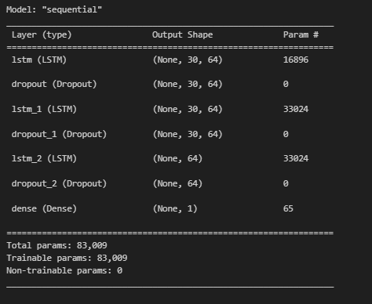
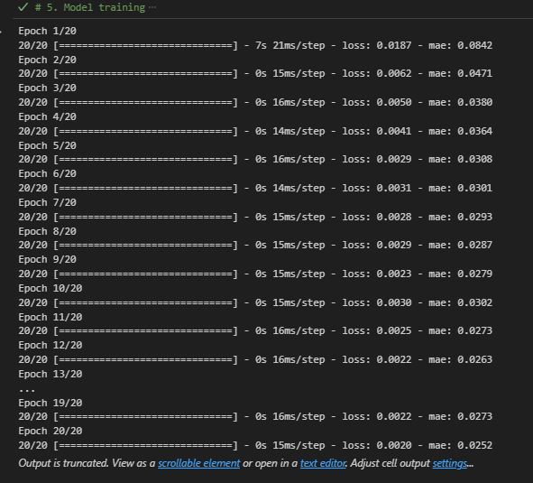
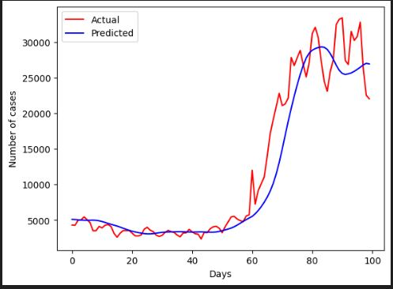
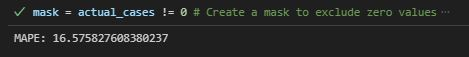

# This is a project to predict covid-19 new cases using the LSTM
## The data used in this project is from : https://github.com/MoH-Malaysia/covid19-public
### Details about the project.
1. All the packages that will be used were imported at the beginning of the code.
2. The data is loaded. Before proceeding with the data, it needs to go through the data inspection part and clean the anomalies or missing Nan values found. In the dataset, there are nan values that needs to be clean and also a non-numeric elements found in certain columns which should be the float type columns. So the non-numeric is deleted because it exist only a few rows which will not greatly affects the data.
The data is also plotted just to see the graph of the new cases.
3. After cleaning, the feature selection will be done. In this case, the MinMaxScaler is selected and the window_size is set at 30 days.
Next is to concatenate train and test data target together.
4. The model is developed with LSTM, Dense and Dropout layers implemented in the model.
- This is the model architecture 

The model is then compiled and undergo Model training and evaluation.

5. The model is deployed and this is the output result.

This is the model performance
